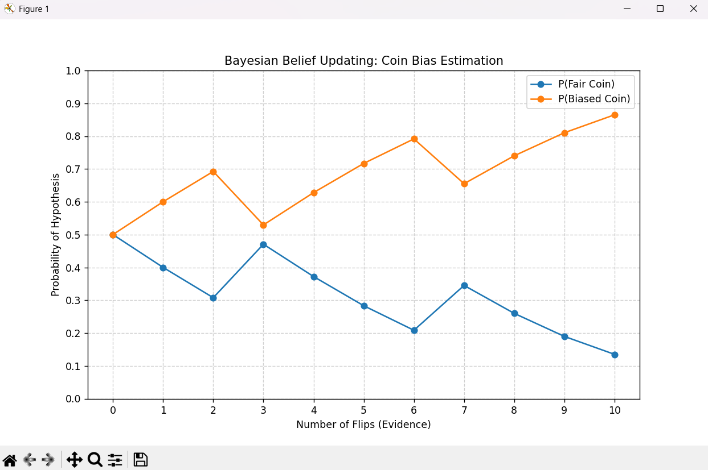

# Bayes' Theorem Simulation

This project is a Python-based simulation designed to provide a hands-on demonstration of the core principles of Bayes' Theorem. It visualizes how our belief in a set of hypotheses is updated as new evidence is acquired sequentially. The simulation begins with a simple coin-flipping problem and is architected to be easily extendable to more complex scenarios with multiple competing hypotheses.


## Core Concepts Demonstrated

This project serves as a practical application of the following concepts:

* **Bayes' Theorem:** The mathematical formula `P(H|E) = [P(E|H) * P(H)] / P(E)` that describes how to update the probability of a hypothesis (`H`) given new evidence (`E`).
* **Prior Probability `P(H)`:** The initial belief in a hypothesis before any new evidence is observed.
* **Likelihood `P(E|H)`:** The probability of observing the evidence *if* the hypothesis were true.
* **Posterior Probability `P(H|E)`:** The updated belief in a hypothesis after the evidence has been taken into account. The posterior from one step becomes the prior for the next.
* **Bayesian Updating:** The iterative process of using the posterior from one step as the prior for the next, allowing beliefs to evolve as more data arrives.

## Features

* **Interactive Simulation:** Provides a command-line interface to enter evidence sequentially and see how beliefs change.
* **Variable Priors:** Easily configure the initial beliefs to see how "strong" or "weak" priors affect the outcome.
* **Multiple Hypotheses:** The simulation engine is built to handle not just two, but any number of competing hypotheses.
* **Clear Visualization:** Uses Matplotlib to generate clear, easy-to-understand plots of how the probability of each hypothesis evolves over time.

## Tech Stack

* **Language:** Python 3
* **Libraries:**
  * NumPy for numerical operations and array manipulation.
  * Matplotlib for data visualization.

## Setup and Usage

Follow these instructions to get the project running on your local machine.

### Prerequisites

* Python 3.x installed on your system.
* pip (Python's package installer).

### Installation

1. **Clone the repository:**

    ```bash
    git clone https://github.com/Fusion831/Bayes-Theorem-Simulation.git
    ```

2. **Navigate to the project directory:**

    ```bash
    cd Bayes-Theorem-Simulation
    ```

3. **Create a `requirements.txt` file:**
    Create a new file named `requirements.txt` in the project directory and add the following lines:

    ```bash
    numpy
    matplotlib
    ```

4. **Install the required libraries:**

    ```bash
    pip install -r requirements.txt
    ```

### Running the Simulation

Execute the main script from your terminal:

```bash
python bayes_simulation.py
```

The script is currently configured to run the "Three Coins" problem. To run it in interactive mode, you will need to modify the `main()` function as described in the code comments or project extensions.

## How It Works

The simulation's logic is cleanly separated into distinct functions for clarity and reusability.

### The Bayesian Update Engine

The core of the simulation is the `bayesian_update()` function. For each new piece of evidence, it performs the following steps:

1. **Calculate Likelihoods:** It retrieves the probability of the observed evidence for *each* hypothesis (e.g., `P('Heads' | Fair Coin)`, `P('Heads' | Biased Coin)`).
2. **Calculate the Numerator:** It multiplies the `likelihood` of each hypothesis by its `current_prior` belief. This gives the unnormalized posterior.
3. **Calculate the Total Evidence Probability:** It sums the unnormalized posteriors from all hypotheses. This becomes the denominator, `P(E)`, which serves to normalize the results.
4. **Calculate the Posterior:** It divides each unnormalized posterior by the denominator. The result is the new set of beliefs (posteriors), which are guaranteed to sum to 1.

### Visualizing the Posterior Probability

The `run_simulation()` function calls the update function for every piece of evidence in a sequence. It stores the resulting posterior probabilities at each step in a list called `belief_history`.

The `plot_belief_history()` function then visualizes this data:

* **The X-axis** represents the number of evidence pieces observed (e.g., number of flips).
* **The Y-axis** represents the probability of a hypothesis being true.
* **Each line** on the plot corresponds to one hypothesis. A point at `(x=5, y=0.7)` for the "Fair Coin" line means: *"After 5 flips, my belief that the coin is fair is 70%."*

### Extensibility: Adding More Hypotheses

The code was intentionally designed to be generic. The core functions do not assume a fixed number of hypotheses. They operate on Python lists and NumPy arrays.

To add or change the hypotheses, you only need to modify the setup variables in the `main()` function:

1. `hypotheses` (list): Add the name of your new hypothesis.
2. `initial_priors` (NumPy array): Add the starting belief for the new hypothesis. **Ensure the array still sums to 1.**
3. `likelihood_table` (dictionary): Add a new entry for your hypothesis, defining the probability of each piece of evidence.

The `run_simulation` and `plot_belief_history` functions will automatically adapt, calculating posteriors and plotting a new line for the added hypothesis without any further changes.

## Project Insights & Conclusions

By running the simulation under different conditions, we can draw several key conclusions.

### Scenario 1: Starting with Neutral Beliefs

This plot shows a simulation run with two hypotheses (Fair vs. Biased) where we started with equal 50/50 priors. The evidence sequence contained more heads than tails.



**Conclusion:** When starting with no initial bias, our beliefs are driven entirely by the evidence. The probability of the "Biased Coin" hypothesis steadily increases as confirming evidence (Heads) is observed.

### Scenario 2: The Impact of a Strong Prior

Here, we started with a strong initial belief (90%) that the coin was fair. We then fed it the *exact same* sequence of evidence as in Scenario 1.


**Conclusion:** The strong prior makes the model "stubborn." Even with evidence suggesting a biased coin, the belief in the fair coin remains higher for the first few flips. It takes a significant amount of contradictory evidence to overcome the initial bias, demonstrating the powerful influence of the prior when data is limited.

### Scenario 3: Distinguishing Between Multiple Hypotheses

This plot shows the final state of the project, distinguishing between three possibilities: a fair coin, a slightly biased coin, and a very biased coin.


**Conclusion:** The Bayesian framework is excellent for comparing multiple competing theories. Here, the evidence quickly allows us to diminish our belief in the "Biased Coin" (green line). However, the evidence is not strong enough to make a definitive choice between the "Fair" (blue) and "Slightly Biased" (orange) coins. The final probabilities reflect this uncertainty, showing that both remain plausible, with the fair coin having a slight edge. This demonstrates that Bayesian analysis can honestly represent ambiguity when the data is not conclusive.
